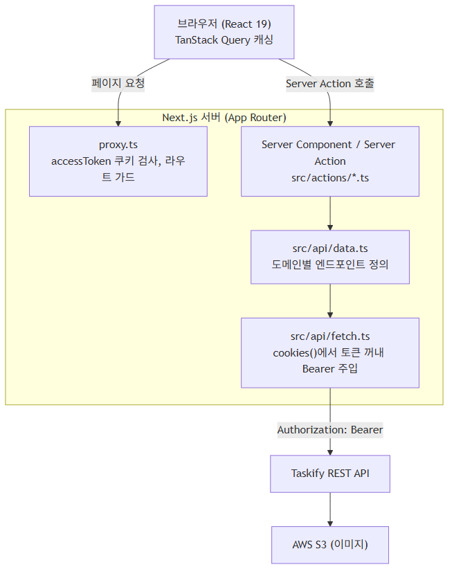

# 📊 Tasklog

> **Forked from:** [Taskify](https://github.com/Useung0830/2-team-taskify)
>
> 팀 프로젝트 'Taskify' 종료 후, 기술적 성장을 이어가고자 이를 포크했습니다.<br>
> 기존의 정체성은 유지하면서 고유한 명칭 '**Tasklog**'로 재배포했으며,<br>
> 리팩토링 중 발견한 버그를 고치고, 자동 코드리뷰를 도입했습니다.

<br>

Tasklog는 대시보드 기반의 칸반 스타일 할 일 관리 서비스입니다.<br>
대시보드를 중심으로 업무를 관리하고 팀원과 협업할 수 있습니다.
<br><br>

## 📍 목차

- [개요](#overview)
- [Fork 이후 개선 작업](#improvements)
- [주요 기능](#features)
- [기술 스택](#stack)
- [시스템 아키텍처](#architecture)
- [코드 품질](#quality)
- [프로젝트 구조](#structure)
- [시작하기](#getting-started)
- [컨벤션](#convention)

---

<div id="overview"></div>

## 📋 개요

| 구분                    | 개발기간           | 내용                                                                                                              |
| ----------------------- | ------------------ | ----------------------------------------------------------------------------------------------------------------- |
| **원본 팀 프로젝트**    | 2026.04.20 ~ 05.07 | 5인 팀, 담당: 칼럼 수정/삭제 페이지, 공통 컴포넌트(Button, DeleteAlertModal, 프로필 변경), 브라우저 자동완성 대응 |
| **Fork 이후 개인 작업** | 2026.05.07 ~ 08.19 | 아래 [Fork 이후 개선 작업](#improvements) 참조                                                                    |

[**Vercel 배포**](https://tasklog-imyoonsoo.vercel.app)

<br>

<div id="improvements"></div>

## 📈 Fork 이후 개선 작업

- **버그 수정**: `dashboard/[id]`의 `params` 타입을 number에서 string으로 수정해 빌드 실패 해결
- **자동 코드리뷰 구축 및 Notion 연동**: PR마다 Claude가 인라인 코멘트로 자동 리뷰하고 요약을 Notion API로 기록, `@claude` 멘션으로도 호출 가능

<br>

<div id="features"></div>

## ✨ 주요 기능

- **대시보드 관리**: 대시보드 생성, 수정, 삭제, 색상 지정
- **칸반보드**: 컬럼 및 카드 CRUD, 컬럼 단위 업무 상태 관리 (모바일은 탭 전환)
- **댓글**: 업무 카드별 댓글 작성, 수정, 삭제
- **팀원 초대 및 관리**: 이메일 기반 대시보드 초대, 멤버 권한 및 목록 관리
- **인증**: 로그인/회원가입, 계정 설정 및 비밀번호 변경
- **마이페이지**: 참여 중인 대시보드 관리 및 초대 수락/거절 목록 확인
- **카드 상세 모달**: 모달로 열어도 URL이 유지되어 새로고침, 공유 시 전체 페이지로 정상 진입

<br>

<div id="stack"></div>

## 🔧 기술 스택

| Category         | Tech                                  |
| :--------------- | :------------------------------------ |
| **Framework**    | Next.js 16 (App Router)               |
| **Library**      | React 19                              |
| **Language**     | TypeScript                            |
| **Styling**      | Tailwind CSS v4                       |
| **Server State** | TanStack Query                        |
| **HTTP Client**  | Fetch                                 |
| **Auth**         | httpOnly 쿠키 + Server Actions        |
| **Code Quality** | ESLint, Prettier, Husky (lint-staged) |

<br>

<div id="architecture"></div>

## 🏗️ 시스템 아키텍처



<br>

<div id="quality"></div>

## ⚡ 코드 품질

Husky + lint-staged로 커밋 전 검사를 자동화했습니다. `git commit` 시 스테이징된 파일에 대해 다음이 자동 실행됩니다.

- `*.{ts,tsx,js,jsx}`: ESLint(`--fix`) 실행 후 Prettier
- `*.{json,md}`: Prettier

<br>

<div id="structure"></div>

## 🗂️ 프로젝트 구조

```
src/
├── actions/       # 서버 액션 (auth, comment, dashboard-edit, setting, revalidate)
├── api/           # API 클라이언트 및 데이터 페칭 (fetch, data)
├── app/           # App Router 페이지 및 레이아웃
│   ├── @modal/    # 병렬 라우트 모달 + (...)card 인터셉팅 라우트
│   ├── card/[cardId]/
│   ├── dashboard/[id]/
│   ├── login/
│   ├── mydashboard/
│   ├── mypage/
│   └── signup/
├── assets/        # 이미지 및 아이콘 (svg, png, 폰트)
├── components/    # 공통 UI 컴포넌트 (Button, Checkbox, Dropdown, SideMenu 등)
│   ├── AuthForm/, Badge/, dialog/, icons/, input/, label/
│   ├── layout/, modal/, profile/, style/, Textarea/
│   └── TaskDetail/Comment/
├── constants/     # 상수 (colors, Auth)
├── contexts/      # React Context (SideMenuContext)
├── hooks/         # 공통 커스텀 훅 (useAuth, useCards, useClickOutside)
├── lib/           # 라이브러리 유틸 (cn 등)
├── providers/     # 전역 Provider (QueryProvider)
├── types/         # 타입 정의 (api, images, svgProps)
└── utils/         # 유틸 함수 (color, dashboard, date, validation)
```

<br>

<div id="getting-started"></div>

## 🚀 시작하기

```bash
npm install
npm run dev      # 개발 서버
npm run build    # 프로덕션 빌드
```

프로젝트 루트에 `.env.local`을 만들고 아래 값을 채워주세요.

```bash
NEXT_PUBLIC_BASE_URL=    # 백엔드 REST API 주소
```

<br>

<div id="convention"></div>

## 🗞 컨벤션

프로젝트 컨벤션은 [`conventions/`](conventions) 폴더의 문서를 참고하세요.

- [git 규칙](conventions/git%20규칙.md)
- [네이밍 규칙](conventions/네이밍%20규칙.md)
- [디렉터리 구조](conventions/디렉터리%20구조.md)
- [코드 스타일](conventions/코드%20스타일.md)
